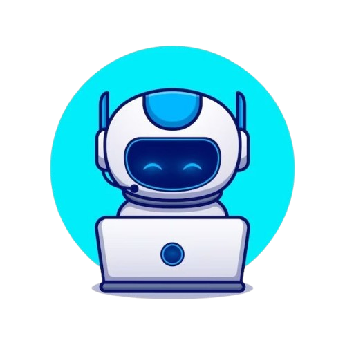

<div align="center">
  
  <h1>Agent47: The Multi-Agent Personal Assistant</h1>
  <p><b>Your Autonomous Executive Assistant for Google Workspace & Beyond</b></p>
</div>

<br/>

## Table of Contents
1. [Overview](#1-overview)
2. [Hackathon Inspiration](#2-hackathon-inspiration)
3. [Powered by Google Ecosystem](#3-powered-by-google-ecosystem)
4. [System Architecture](#4-system-architecture)
5. [Key Features](#5-key-features)
6. [Setup & Installation](#6-setup--installation)
   - 6.1. [Prerequisites](#61-prerequisites)
   - 6.2. [Clone Workspace MCP Server](#62-clone-workspace-mcp-server)
   - 6.3. [Configure Google Cloud OAuth](#63-configure-google-cloud-oauth)
   - 6.4. [Environment Configuration](#64-environment-configuration)
   - 6.5. [Python Environment Setup](#65-python-environment-setup)
   - 6.6. [Build & Authenticate MCP Server](#66-build--authenticate-mcp-server)
   - 6.7. [Frontend Setup](#67-frontend-setup)
7. [Running the Assistant](#7-running-the-assistant)
8. [Example Prompts](#8-example-prompts)
9. [What's Next for Agent47?](#9-whats-next-for-agent47)

---

## 1. Overview

**Agent47** is an intelligent, multi-agent AI system built using the **Google Agent Development Kit (ADK)** and powered by **Gemini 2.5 Flash from Vertex AI**. It acts as a comprehensive personal assistant, capable of orchestrating complex workflows across Google Workspace applications while seamlessly managing local tasks and notes.

Agent47’s core innovation lies in its **AI-driven orchestration** layer, which transforms natural language inputs into structured, multi-step workflows. Leveraging a hierarchical multi-agent architecture, the system intelligently interprets user intent, dynamically delegates tasks to specialized agents, and executes actions across integrated platforms such as Google Workspace. This positions Agent47 beyond conventional conversational AI, enabling it to function as an autonomous operational assistant rather than a passive response generator.

---

## 2. Hackathon Inspiration

Our main inspiration is to dramatically **increase productivity for both students and office workers** by unifying their daily Google Workspace tools. In today's fast-paced environment, users constantly context-switch between emails, calendars, document editing, and task management. 

By leveraging an orchestrator (root agent) that intelligently delegates tasks to specialized sub-agents, we've created a system that truly understands the nuances of daily office operations. Agent47 transforms disjointed Google tools into a single, cohesive, conversational interface designed to save time and boost output.

---

## 3. Powered by Google Ecosystem

To achieve enterprise-grade reliability, security, and performance, Agent47 is natively integrated across the Google Cloud and Workspace ecosystems:

- **Core Model:** Gemini 2.5 Flash from Vertex AI
- **Multi-Agent Framework:** Google Agent Development Kit (ADK)
- **Database Services:** Google Cloud SQL (Persistent Memory)
- **Voice Intelligence:** Google Cloud Speech-to-Text
- **Authentication:** Google Cloud OAuth 2.0
- **Workspace Integrations:** Gmail, Calendar, Docs, Sheets, Slides, and Google Chat.
- **Data Standard:** Google Workspace MCP (Model Context Protocol)

---

## 4. System Architecture

Agent47 utilizes a hierarchical multi-agent architecture. The `root_agent` acts as the orchestrator, routing natural language intents to specialized domain agents. These domain agents interact directly with the **Google Workspace MCP (Model Context Protocol)** server to execute core actions across the suite. 

The following table outlines the individual agents and their specific responsibilities.

| Agent Name | Description | Access Level |
| :--- | :--- | :--- |
| `calendar_agent` | Manages Google Calendar via Workspace MCP server | Read/Write |
| `gmail_agent` | Handles Gmail: search, read, label, draft, send | Read/Write |
| `chat_agent` | Interacts with Google Chat spaces, threads, DMs | Read/Write |
| `docs_agent` | Google Docs: create, read, edit, format | Read/Write |
| `sheets_agent` | Google Sheets: advanced read operations | Read-Only |
| `slides_agent` | Google Slides: metadata, text, and image review | Read-Only |
| `tasks_agent` | Task management via Google Cloud SQL | Read/Write |
| `notes_agent` | Notes management via Google Cloud SQL | Read/Write |

---

## 5. Key Features

| Feature | Description |
| :--- | :--- |
| **AI Orchestration Engine** | State-of-the-art routing using Gemini 2.5 Flash from Vertex AI to determine which sub-agent is best suited for a task. |
| **Voice Interface** | Integrated Voice-to-Text via Google Cloud Speech-to-Text for a seamless interactive, hands-free conversational experience. |
| **Autonomous Delegation** | State-of-the-art routing using Gemini 2.5 Flash from Vertex AI to determine which sub-agent is best suited for a task. |
| **Google Workspace Integration** | Native connection to Calendar, Gmail, Chat, Docs (Read/Write), Sheets (Read-Only), and Slides (Read-Only). |
| **Persistent Memory** | Google Cloud SQL-backed database for efficiently managing and scaling personal tasks and notes across sessions. |
| **REST API + Web UI** | Headless architecture allowing both robust API integrations and interactive dev UI backend. |

---

## 6. Setup & Installation

### 6.1. Prerequisites
- **Python 3.11+**
- **Node.js 20+**
- A Google Cloud project with **billing enabled**
- `gcloud` CLI installed and authenticated

### 6.2. Clone Workspace MCP Server
Agent47 relies on the Google Workspace MCP (Model Context Protocol) server for deep integrations.
```bash
git clone https://github.com/gemini-cli-extensions/workspace workspace
```

### 6.3. Configure Google Cloud OAuth
Set up the necessary GCP infrastructure for Workspace authentication:
```bash
cd workspace
gcloud config set project YOUR_PROJECT_ID
bash scripts/setup-gcp.sh
cd ..
```
> **Note:** The script will output a `WORKSPACE_CLIENT_ID` and `WORKSPACE_CLOUD_FUNCTION_URL`. Save these for the next step.

### 6.4. Environment Configuration
Create your environment variables file to tie the system together:
```bash
cp .env.example backend/.env
```
Ensure you fill in `GOOGLE_CLOUD_PROJECT`, `WORKSPACE_CLIENT_ID`, and `WORKSPACE_CLOUD_FUNCTION_URL` inside `backend/.env`.

### 6.5. Python Environment Setup
Initialize the core backend:
```bash
python -m venv .venv
source .venv/bin/activate  # On Windows use: .venv\Scripts\activate
pip install -r requirements.txt
```

### 6.6. Build & Authenticate MCP Server
Build the workspace connector and perform your initial machine authentication:
```bash
cd workspace
npm install
npm run build
cd workspace-server
node dist/headless-login.js
# Your browser will open — sign in with your Google Workspace account!
cd ../../
```

### 6.7. Frontend Setup
Install the dependencies for the custom React/Vite frontend and configure its environment:
```bash
cd frontend
npm install
cp .env.example .env
cd ..
```
> **Note:** The `VITE_API_URL` in `.env` defaults to `http://localhost:8000` to seamlessly connect with your local backend.

---

## 7. Running the Assistant

You can interact with Agent47 through the custom Frontend, the Dev UI, or via the REST API. We **highly recommend** using the custom Frontend for the best experience and voice-to-text capabilities.

### **The Easy Way (One-Command Start):**
Simply execute the provided convenience script from the project root to run both the frontend and backend simultaneously:
```bash
./start.sh
```

### **The Manual Way:**
**Launch Custom Frontend:**
```bash
cd frontend
npm run dev
```

**Launch REST API:**
```bash
source .venv/bin/activate
uvicorn backend.api:app --host 0.0.0.0 --port 8000
```

**Launch ADK Dev UI:**
```bash
source .venv/bin/activate
adk web
```

**Full API Endpoints Table:**

| Method | Endpoint | Description |
| :--- | :--- | :--- |
| `GET` | `/auth/login` | Return an OAuth consent URL for a specific user ID |
| `GET` | `/auth/callback` | OAuth redirect callback handler to receive tokens |
| `GET` | `/auth/status/{user_id}` | Check token validation status for a specific user |
| `GET` | `/auth/users` | List all authenticated users |
| `DELETE` | `/auth/logout/{user_id}` | Invalidate tokens and clear workspace runners |
| `GET` | `/health` | System status ping check |
| `WS` | `/ws/speech` | Real-time WebSocket audio streaming using Cloud Speech-to-Text |
| `POST` | `/run` | Execute commands. Payload: `{"message": "...", "user_id": "...", "session_id": "..."}` |
| `DELETE` | `/sessions/{session_id}` | Clear a specific chat session for a user |

---

## 8. Example Prompts

Agent47 excels at complex natural language commands. Try asking actions like:

| Category | Example Prompt |
| :--- | :--- |
| **Scheduling** | "Schedule a standup tomorrow at 10am with alice@example.com" |
| **Email Triage** | "Find unread emails from this week about Q2 planning" |
| **Document Generation** | "Create a Google Doc called Weekly Summary with today's highlights" |
| **Communications** | "Send a Chat message to the eng standup space: build is green" |
| **Task Management** | "Create a task: Review PR by Friday, high priority" and "Show all pending tasks" |
| **Knowledge Retrieval**| "Summarize slide text from presentation <presentation_id>" |
| **Note Taking** | "Save a note: team offsite ideas — tags: work,planning" |

---

## 9. What's Next for Agent47?

We are aggressively driving the platform toward a fully production-ready release with the following strategic priorities:

- **Performance Optimization:** We are continuously tuning our agent orchestration flow to significantly improve response latency and streamline high-volume data processing speeds.
- **Enterprise Verification:** We are actively navigating the official Google OAuth Console verification process to ensure secure, scalable, and compliant third-party access control.
- **Enhanced Prompt Engineering:** We are optimizing internal system prompts to drastically empower our agents, ensuring precise domain context mapping and elevating the overall productivity yields for our users.

<br/>

<div align="center">
  <i>Built with Google ADK and Gemini 2.5 Flash from Vertex AI.</i>
</div>
